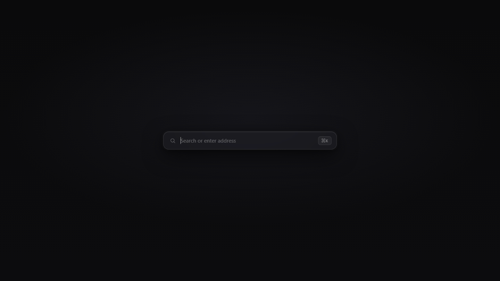
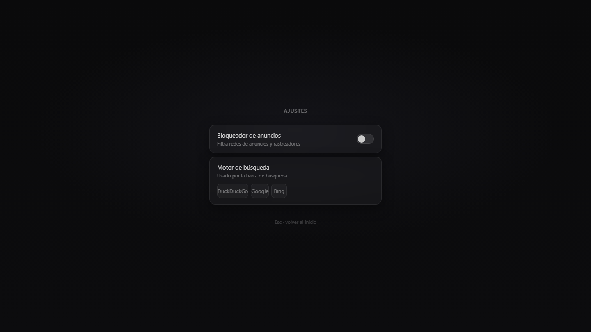

# minibrowser

Navegador minimalista construido con [Tauri 2](https://tauri.app/) (Rust + Wry) y una interfaz web en HTML/CSS/JS. Enfocado en ser ligero, con poco consumo de RAM y controles por teclado al estilo tmux.

## Características

- **Bloqueador de anuncios** integrado: filtra redes de anuncios y rastreadores por dominio y por patrón de URL (incluidos los anuncios de video de YouTube).
- **Workspaces** (estilo tmux): múltiples webviews en pestañas que se ocultan/muestran dentro de la misma ventana.
- **Motor de búsqueda configurable**: DuckDuckGo, Google o Bing.
- **Navegación por atajos de teclado**, disponibles incluso en páginas remotas.
- **DNS-over-HTTPS** forzado a Cloudflare y GPU desactivada para reducir el uso de RAM.
- Ajustes persistidos en disco (`settings.json`).

## Capturas de pantalla

Página de inicio:



Pantalla de ajustes:



## Atajos de teclado

| Atajo | Acción |
| ----- | ------ |
| `Ctrl`/`Cmd` + `K` o `L` | Enfocar la barra de búsqueda |
| `Ctrl`/`Cmd` + `E` | Abrir ajustes |
| `Ctrl`/`Cmd` + `R` | Recargar página |
| `Ctrl`/`Cmd` + `[` / `]` | Atrás / adelante |
| `Ctrl`/`Cmd` + `T` | Nuevo workspace |
| `Ctrl`/`Cmd` + `←` / `→` | Cambiar de workspace |
| `Esc` | Volver al inicio (en páginas remotas) |

## Estructura

```
dist/                    Interfaz web (página de inicio y ajustes)
src-tauri/
  src/main.rs            Backend: navegación, adblock, workspaces, ajustes
  capabilities/          Permisos de Tauri (local y remoto)
  tauri.conf.json        Configuración de la app
  icons/                 Iconos
```

## Desarrollo

Requisitos: [Rust](https://www.rust-lang.org/) y las dependencias de [Tauri](https://tauri.app/start/prerequisites/).

```sh
cargo tauri dev    # ejecutar en modo desarrollo
cargo tauri build  # compilar instalador
```

## Licencia

Sin licencia especificada.
